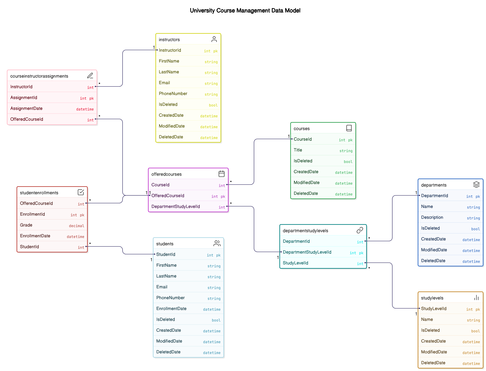

# College Academic Management System API

The **College Academic Management System API** is a comprehensive solution for managing academic entities such as students, instructors, courses, departments, study levels, and their relationships. This API is built using ASP.NET Core with a layered architecture and targets `.NET 9`.

---

## Table of Contents
1. [Overview](#overview)
2. [Entities](#entities)
3. [Controllers](#controllers)
4. [Endpoints](#endpoints)
5. [Usage](#usage)
6. [Contributing](#contributing)
7. [License](#license)

---

## Overview

This API provides endpoints to manage:
- **Students**: CRUD operations and filtering by department or study level.
- **Instructors**: CRUD operations and filtering.
- **Courses**: CRUD operations and filtering by department, study level, or instructor.
- **Departments**: CRUD operations and managing study levels.
- **Study Levels**: CRUD operations and filtering by department or course.
- **Student Enrollments**: Managing student enrollments in courses.
- **Course Instructor Assignments**: Managing instructor assignments to courses.

### Live Demo
The API is deployed and accessible at: [College Academic Management System](https://collegeacadimcmanagementsystem.runasp.net)

---

## Entities

### 1. **Student**
Represents a student in the system.
- **Properties**:
  - `Id`: Unique identifier.
  - `FirstName`, `LastName`: Name of the student.
  - `Email`, `PhoneNumber`: Contact details.
  - `IsDeleted`: Soft delete flag.
  - `CreatedDate`, `ModifiedDate`, `DeletedDate`: Timestamps.
  - `StudentEnrollments`: List of enrollments.

### 2. **Instructor**
Represents an instructor in the system.
- **Properties**:
  - `Id`: Unique identifier.
  - `FirstName`, `LastName`: Name of the instructor.
  - `Email`, `PhoneNumber`: Contact details.
  - `IsDeleted`: Soft delete flag.
  - `CreatedDate`, `ModifiedDate`, `DeletedDate`: Timestamps.
  - `CourseInstructorAssignments`: List of course assignments.

### 3. **Department**
Represents a department in the system.
- **Properties**:
  - `Id`: Unique identifier.
  - `Name`, `Description`: Details about the department.
  - `IsDeleted`: Soft delete flag.
  - `CreatedDate`, `ModifiedDate`, `DeletedDate`: Timestamps.
  - `DepartmentStudyLevels`: List of study levels.

### 4. **Study Level**
Represents a study level (e.g., undergraduate, postgraduate).
- **Properties**:
  - `Id`: Unique identifier.
  - `Name`: Name of the study level.
  - `IsDeleted`: Soft delete flag.
  - `CreatedDate`, `ModifiedDate`, `DeletedDate`: Timestamps.
  - `DepartmentStudyLevels`: List of departments associated with this study level.

### 5. **Department Study Level**
Represents the relationship between a department and a study level.
- **Properties**:
  - `Id`: Unique identifier.
  - `DepartmentId`, `StudyLevelId`: Foreign keys.
  - `Department`, `StudyLevel`: Navigation properties.
  - `OfferedCourses`: List of courses offered.

### 6. **Offered Course**
Represents a course offered by a department at a specific study level.
- **Properties**:
  - `Id`: Unique identifier.
  - `CourseId`: Foreign key to the course.
  - `DepartmentStudyLevelId`: Foreign key to the department-study level relationship.
  - `CourseInstructorAssignments`, `StudentEnrollments`: Navigation properties.

### 7. **Course Instructor Assignment**
Represents the assignment of an instructor to a course.
- **Properties**:
  - `Id`: Unique identifier.
  - `InstructorId`, `OfferedCourseId`: Foreign keys.
  - `Date`: Assignment date.
  - `Instructor`, `OfferedCourse`: Navigation properties.

---

## Controllers

### 1. **StudentsController**
Manages student-related operations.
- **Endpoints**:
  - `GET /students`: Get all students with pagination and optional search.
  - `GET /students/{id}`: Get a student by ID.
  - `GET /students/department/{departmentId}`: Get students by department.
  - `GET /students/study-level/{depStudyLevelId}`: Get students by study level.
  - `POST /students`: Add a new student.
  - `PUT /students/{id}`: Update a student.
  - `DELETE /students/{id}`: Delete a student.

### 2. **InstructorsController**
Manages instructor-related operations.
- **Endpoints**:
  - `GET /instructors`: Get all instructors with pagination and optional search.
  - `GET /instructors/{id}`: Get an instructor by ID.
  - `POST /instructors`: Add a new instructor.
  - `PUT /instructors/{id}`: Update an instructor.
  - `DELETE /instructors/{id}`: Delete an instructor.

### 3. **CoursesController**
Manages course-related operations.
- **Endpoints**:
  - `GET /courses`: Get all courses with pagination and optional search.
  - `GET /courses/{id}`: Get a course by ID.
  - `GET /courses/department/{departmentId}`: Get courses by department.
  - `GET /courses/study-level/{depStudyLevelId}`: Get courses by study level.
  - `GET /courses/instructor/{instructorId}`: Get courses by instructor.
  - `POST /courses`: Add a new course.
  - `PUT /courses/{id}`: Update a course.
  - `DELETE /courses/{id}`: Delete a course.

### 4. **DepartmentsController**
Manages department-related operations.
- **Endpoints**:
  - `GET /departments`: Get all departments with pagination and optional search.
  - `GET /departments/{id}`: Get a department by ID.
  - `POST /departments`: Add a new department.
  - `POST /departments/study-level`: Add a study level to a department.
  - `PUT /departments/{id}`: Update a department.
  - `DELETE /departments/{id}`: Delete a department.

### 5. **StudyLevelsController**
Manages study level-related operations.
- **Endpoints**:
  - `GET /study-levels`: Get all study levels with pagination and optional search.
  - `GET /study-levels/{id}`: Get a study level by ID.
  - `GET /study-levels/department/{departmentId}`: Get study levels by department.
  - `GET /study-levels/course/{courseId}`: Get study levels by course.
  - `POST /study-levels`: Add a new study level.
  - `PUT /study-levels/{id}`: Update a study level.
  - `DELETE /study-levels/{id}`: Delete a study level.

### 6. **StudentEnrollmentController**
Manages student enrollments.
- **Endpoints**:
  - `GET /enrollments/student/{studentId}`: Get enrollments by student.
  - `GET /enrollments/study-level/{depStudyLevelId}`: Get enrollments by study level.
  - `GET /enrollments/course/{offeredCourseId}`: Get enrollments by course.

### 7. **CourseInstructorAssignmentsController**
Manages course instructor assignments.
- **Endpoints**:
  - `GET /assignments`: Get all assignments with pagination.
  - `GET /assignments/{id}`: Get an assignment by ID.
  - `GET /assignments/instructor/{instructorId}`: Get assignments by instructor.
  - `GET /assignments/course/{offeredCourseId}`: Get assignments by course.

  
---

## Usage

- Use tools like Postman or Swagger to test the API endpoints.
- Ensure the database is properly configured in the `appsettings.json` file.

---

## Contributing

Contributions are welcome! Please fork the repository and submit a pull request.

---

## License

This project is licensed under the MIT License.
